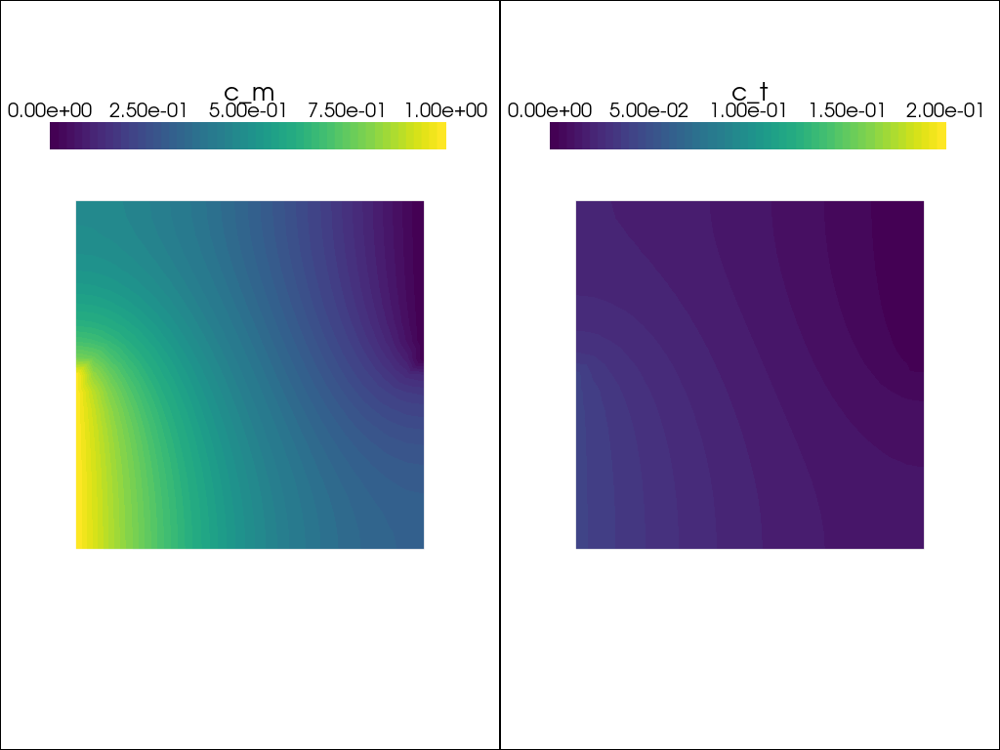
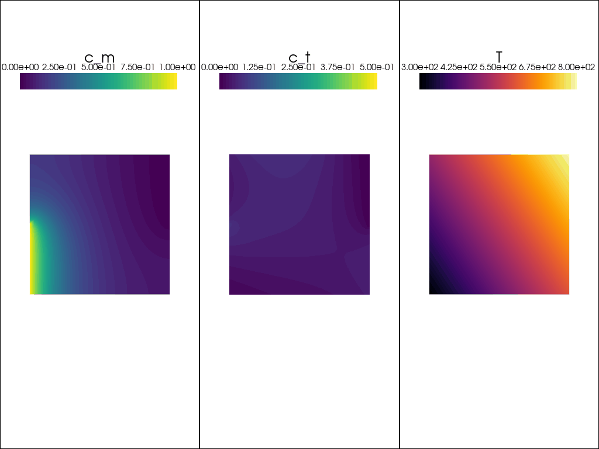

---
jupytext:
  formats: ipynb,md:myst
  text_representation:
    extension: .md
    format_name: myst
    format_version: 0.13
    jupytext_version: 1.19.1
kernelspec:
  display_name: festim-workshop
  language: python
  name: python3
---

# Temperature dependence

A lot of hydrogen transport processes are thermally activated, meaning they are goverened by a property following an Arrhenius law.
For instance, the diffusivity $D$ can be written as

$$
D = D_0 \exp{\left(\frac{-E_D}{k_B ~T}\right)}
$$
where $D_0$ is called the pre-exponential factor, $E_D$ the activation energy, $T$ the temperature, and $k_B$ the Boltzmann constant.

## Non-constant temperature

We will take the same example as above but setting a temperature dependence for $D$, $k$, and $p$ and a non-constant temperature.

\begin{equation}
T(t) = \begin{cases}
400 ~\mathrm{K} \quad \text{for } t < 15\\
800 ~\mathrm{K} \quad \text{otherwise}
\end{cases}
\end{equation}

```{code-cell} ipython3
import dolfinx
import numpy as np
import ufl
from dolfinx.fem.petsc import NonlinearProblem
from petsc4py import PETSc
from mpi4py import MPI
from dolfinx import mesh
from dolfinx import fem
import basix
from scifem import assemble_scalar
```

```{code-cell} ipython3
nx = ny = 20

domain = mesh.create_unit_square(MPI.COMM_WORLD, nx, ny, mesh.CellType.quadrilateral)
tdim = domain.topology.dim
fdim = tdim - 1
domain.topology.create_connectivity(fdim, tdim)

cg_element = basix.ufl.element("Lagrange", domain.basix_cell(), degree=1)

mixed_element = basix.ufl.mixed_element([cg_element, cg_element])

V = fem.functionspace(domain, mixed_element)

u = fem.Function(V)
u_n = fem.Function(V)

cm, ct = ufl.split(u)
cm_n, ct_n = ufl.split(u_n)

v_cm, v_ct = ufl.TestFunctions(V)

def inlet(x):
    return np.logical_and(np.isclose(x[0], 0), x[1] <= 0.5)

def outlet(x):
    return np.logical_and(np.isclose(x[0], 1), x[1] >= 0.5)

V0, submap = V.sub(0).collapse()

dofs_outlet = fem.locate_dofs_geometrical((V.sub(0), V0), outlet)
dofs_inlet = fem.locate_dofs_geometrical((V.sub(0), V0), inlet)

c_inlet = fem.Constant(domain, 1.0)
c_outlet = fem.Constant(domain, 0.0)

bc_outlet = fem.dirichletbc(c_outlet, dofs_outlet[0], V.sub(0))
bc_inlet = fem.dirichletbc(c_inlet, dofs_inlet[0], V.sub(0))
```

```{code-cell} ipython3
T = dolfinx.fem.Constant(domain, 400.0)

def arrhenius_rate(k0, Ek, T, mod=ufl):
    boltzmann_constant = 8.617333262145e-5  # eV/K
    return k0 * mod.exp(-Ek/(T*boltzmann_constant))

k = arrhenius_rate(1e2, 0.2, T) # trapping rate
p = arrhenius_rate(5e9, 1.5, T)  # detrapping rate
n = 0.5  # total trapping sites
D = arrhenius_rate(1e3, 0.2, T) # diffusion coefficient
```

```{code-cell} ipython3
dt = dolfinx.fem.Constant(domain, 0.3)

F_mobile_transient = (cm - cm_n)/dt* v_cm * ufl.dx
F_trapped_transient = (ct - ct_n)/dt * v_ct * ufl.dx

trapping = k * cm * (n - ct)
detrapping = p * ct

F_mobile = (
    D*ufl.dot(ufl.grad(cm), ufl.grad(v_cm)) * ufl.dx
    + trapping * v_cm * ufl.dx
    - detrapping * v_cm * ufl.dx
)
F_trapped = -trapping * v_ct * ufl.dx + detrapping * v_ct * ufl.dx

F = F_mobile_transient + F_trapped_transient + F_mobile + F_trapped
```

```{code-cell} ipython3
# taken from https://github.com/FEniCS/dolfinx/blob/5fcb988c5b0f46b8f9183bc844d8f533a2130d6a/python/demo/demo_cahn-hilliard.py#L279C1-L286C28
use_superlu = PETSc.IntType == np.int64  # or PETSc.ScalarType == np.complex64
sys = PETSc.Sys()  # type: ignore
if sys.hasExternalPackage("mumps") and not use_superlu:
    linear_solver = "mumps"
elif sys.hasExternalPackage("superlu_dist"):
    linear_solver = "superlu_dist"
else:
    linear_solver = "petsc"

petsc_options = {
    "snes_type": "newtonls",
    "snes_linesearch_type": "none",
    "snes_stol": np.sqrt(np.finfo(dolfinx.default_real_type).eps) * 1e-2,
    "snes_atol": 1e-10,
    "snes_rtol": 1e-10,
    "snes_max_it": 100,
    "snes_divergence_tolerance": "PETSC_UNLIMITED",
    "ksp_type": "preonly",
    "pc_type": "lu",
    "pc_factor_mat_solver_type": linear_solver,
    # "snes_monitor": None,
}

problem = NonlinearProblem(
    F,
    u,
    bcs=[bc_outlet, bc_inlet],
    petsc_options=petsc_options,
    petsc_options_prefix="poisson_transient_temp",
)
```

```{code-cell} ipython3
import matplotlib as mpl
import pyvista
from dolfinx import plot

c_m_post = u.split()[0].collapse()
c_t_post = u.split()[1].collapse()

grid_c_m = pyvista.UnstructuredGrid(*plot.vtk_mesh(c_m_post.function_space))
grid_c_t = pyvista.UnstructuredGrid(*plot.vtk_mesh(c_t_post.function_space))

grid_c_m.point_data["c_m"] = c_m_post.x.array
grid_c_t.point_data["c_t"] = c_t_post.x.array

viridis = mpl.colormaps.get_cmap("viridis").resampled(50)
sargs = dict(
    title_font_size=25,
    label_font_size=20,
    fmt="%.2e",
    color="black",
    position_x=0.1,
    position_y=0.8,
    width=0.8,
    height=0.1,
)

plotter = pyvista.Plotter(shape=(1, 2))
plotter.open_gif("transient_temperature.gif", fps=7)

plotter.subplot(0, 0)
plotter.view_xy(bounds=[0, 1, 0, 1, 0, 0])
_ = plotter.add_mesh(
    grid_c_m,
    show_edges=False,
    lighting=False,
    cmap=viridis,
    scalar_bar_args=sargs,
    clim=[0, 1],
)

plotter.subplot(0, 1)
plotter.view_xy(bounds=[0, 1, 0, 1, 0, 0])

_ = plotter.add_mesh(
    grid_c_t,
    show_edges=False,
    lighting=False,
    cmap=viridis,
    scalar_bar_args=sargs,
    clim=[0, 0.2],
)
```

```{code-cell} ipython3
inventories_cm = []
inventories_ct = []
times = []

t = 0.0
t_final = 20
n_it = 0

while t < t_final:
    t += dt.value
    n_it += 1
    times.append(t)

    # solve the problem with the current u_n as previous solution
    problem.solve()
    converged = problem.solver.getConvergedReason()
    num_iter = problem.solver.getIterationNumber()
    assert converged > 0, f"Solver did not converge, got {converged}."
    print(
        f"Time: {t:.2f} ({n_it=}). \n Solver converged after {num_iter} iterations with converged reason {converged}."
    )

    # update u_n with the current solution u
    u_n.x.array[:] = u.x.array[:]

    # update inlet value to show transient response
    c_inlet.value = 1.0 if t < 5 else 0.0
    T.value = 300.0 if t < 15 else 800.0

    # post processing
    c_m_post = u.split()[0].collapse()
    c_t_post = u.split()[1].collapse()

    # Update plot
    grid_c_m.point_data["c_m"][:] = c_m_post.x.array
    grid_c_t.point_data["c_t"][:] = c_t_post.x.array
    plotter.write_frame()

    # compute inventory
    inventories_cm.append(assemble_scalar(c_m_post * ufl.dx))
    inventories_ct.append(assemble_scalar(c_t_post * ufl.dx))

plotter.close()
```



+++

When the inlet concentration drops, the mobile inventory quickly drops to zero. But the trapped inventory doesn't. That's because the detrapping rate $p$ is too low at this temperature.

It's only when the temperature is increased at $t=15$ that the trapped hydrogen starts detrapping and leave.

```{code-cell} ipython3
import matplotlib.pyplot as plt
plt.stackplot(times, inventories_cm, inventories_ct, labels=["mobile", "trapped"])
plt.ylabel("Inventory")
plt.xlabel("Time")
plt.legend(reverse=True)
plt.show()
```

## Non-homogeneous temperature

Now we will do the same thing but with a non-_homogeneous_ temperature (ie. varying in space)

\begin{equation}
T(x,y) = 300 + 300~x + 200~y
\end{equation}

```{code-cell} ipython3
nx = ny = 30

domain = mesh.create_unit_square(MPI.COMM_WORLD, nx, ny, mesh.CellType.quadrilateral)
tdim = domain.topology.dim
fdim = tdim - 1
domain.topology.create_connectivity(fdim, tdim)

cg_element = basix.ufl.element("Lagrange", domain.basix_cell(), degree=1)

mixed_element = basix.ufl.mixed_element([cg_element, cg_element])

V = fem.functionspace(domain, mixed_element)

u = fem.Function(V)
u_n = fem.Function(V)

cm, ct = ufl.split(u)
cm_n, ct_n = ufl.split(u_n)

v_cm, v_ct = ufl.TestFunctions(V)

def inlet(x):
    return np.logical_and(np.isclose(x[0], 0), x[1] <= 0.5)

def outlet(x):
    return np.logical_and(np.isclose(x[0], 1), x[1] >= 0.5)

V0, submap = V.sub(0).collapse()

dofs_outlet = fem.locate_dofs_geometrical((V.sub(0), V0), outlet)
dofs_inlet = fem.locate_dofs_geometrical((V.sub(0), V0), inlet)

c_inlet = fem.Constant(domain, 1.0)
c_outlet = fem.Constant(domain, 0.0)

bc_outlet = fem.dirichletbc(c_outlet, dofs_outlet[0], V.sub(0))
bc_inlet = fem.dirichletbc(c_inlet, dofs_inlet[0], V.sub(0))
```

Because $T$ is now a function of space, it needs to become a `dolfinx.fem.Function`.
We create a new functionspace for `T`, and then create a `Function` from it.

Then, we call the `.interpolate()` method with an appropriate `lambda` function of `x`.

```{note}
In this context, `x[0]` is the first coordinate ($x$) and `x[1]` is the second one ($y$)
```

```{code-cell} ipython3
V_cg = dolfinx.fem.functionspace(domain, ("CG", 1))
T = dolfinx.fem.Function(V_cg)

T.interpolate(lambda x: 300.0 + 300.0*x[0] + 200.0*x[1])
```

```{code-cell} ipython3
def arrhenius_rate(k0, Ek, T, mod=ufl):
    boltzmann_constant = 8.617333262145e-5  # eV/K
    return k0 * mod.exp(-Ek/(T*boltzmann_constant))

k = arrhenius_rate(1e2, 0.2, T) # trapping rate
p = arrhenius_rate(5e9, 1.5, T)  # detrapping rate
n = 0.5  # total trapping sites
D = arrhenius_rate(1e3, 0.2, T) # diffusion coefficient
```

```{code-cell} ipython3
dt = dolfinx.fem.Constant(domain, 0.6)

F_mobile_transient = (cm - cm_n)/dt* v_cm * ufl.dx
F_trapped_transient = (ct - ct_n)/dt * v_ct * ufl.dx

trapping = k * cm * (n - ct)
detrapping = p * ct

F_mobile = (
    D*ufl.dot(ufl.grad(cm), ufl.grad(v_cm)) * ufl.dx
    + trapping * v_cm * ufl.dx
    - detrapping * v_cm * ufl.dx
)
F_trapped = -trapping * v_ct * ufl.dx + detrapping * v_ct * ufl.dx

F = F_mobile_transient + F_trapped_transient + F_mobile + F_trapped
```

```{code-cell} ipython3
# taken from https://github.com/FEniCS/dolfinx/blob/5fcb988c5b0f46b8f9183bc844d8f533a2130d6a/python/demo/demo_cahn-hilliard.py#L279C1-L286C28
use_superlu = PETSc.IntType == np.int64  # or PETSc.ScalarType == np.complex64
sys = PETSc.Sys()  # type: ignore
if sys.hasExternalPackage("mumps") and not use_superlu:
    linear_solver = "mumps"
elif sys.hasExternalPackage("superlu_dist"):
    linear_solver = "superlu_dist"
else:
    linear_solver = "petsc"

petsc_options = {
    "snes_type": "newtonls",
    "snes_linesearch_type": "none",
    "snes_stol": np.sqrt(np.finfo(dolfinx.default_real_type).eps) * 1e-2,
    "snes_atol": 1e-10,
    "snes_rtol": 1e-10,
    "snes_max_it": 100,
    "snes_divergence_tolerance": "PETSC_UNLIMITED",
    "ksp_type": "preonly",
    "pc_type": "lu",
    "pc_factor_mat_solver_type": linear_solver,
    # "snes_monitor": None,
}

problem = NonlinearProblem(
    F,
    u,
    bcs=[bc_outlet, bc_inlet],
    petsc_options=petsc_options,
    petsc_options_prefix="non_homogeneous_temperature",
)
```

```{code-cell} ipython3
import matplotlib as mpl
c_m_post = u.split()[0].collapse()
c_t_post = u.split()[1].collapse()

grid_c_m = pyvista.UnstructuredGrid(*plot.vtk_mesh(c_m_post.function_space))
grid_c_t = pyvista.UnstructuredGrid(*plot.vtk_mesh(c_t_post.function_space))
grid_T = pyvista.UnstructuredGrid(*plot.vtk_mesh(T.function_space))

grid_c_m.point_data["c_m"] = c_m_post.x.array
grid_c_t.point_data["c_t"] = c_t_post.x.array
grid_T.point_data["T"] = T.x.array

viridis = mpl.colormaps.get_cmap("viridis").resampled(50)
sargs = dict(
    title_font_size=25,
    label_font_size=15,
    fmt="%.2e",
    color="black",
    position_x=0.1,
    position_y=0.8,
    width=0.8,
    height=0.1,
)

plotter = pyvista.Plotter(shape=(1, 3))
plotter.open_gif("non_homogeneous_temperature.gif", fps=7)

plotter.subplot(0, 0)
plotter.view_xy(bounds=[0, 1, 0, 1, 0, 0])
_ = plotter.add_mesh(
    grid_c_m,
    show_edges=False,
    lighting=False,
    cmap=viridis,
    scalar_bar_args=sargs,
    clim=[0, 1],
)

plotter.subplot(0, 1)
plotter.view_xy(bounds=[0, 1, 0, 1, 0, 0])

_ = plotter.add_mesh(
    grid_c_t,
    show_edges=False,
    lighting=False,
    cmap=viridis,
    scalar_bar_args=sargs,
    clim=[0, n],
)

plotter.subplot(0, 2)
plotter.view_xy(bounds=[0, 1, 0, 1, 0, 0])

_ = plotter.add_mesh(
    grid_T,
    show_edges=False,
    lighting=False,
    cmap="inferno",
    scalar_bar_args=sargs,
)
```

```{code-cell} ipython3
t = 0.0
t_final = 10
n_it = 0

while t < t_final:
    t += dt.value
    n_it += 1

    # solve the problem with the current u_n as previous solution
    problem.solve()
    converged = problem.solver.getConvergedReason()
    num_iter = problem.solver.getIterationNumber()
    assert converged > 0, f"Solver did not converge, got {converged}."
    print(
        f"Time: {t:.2f} ({n_it=}). \n Solver converged after {num_iter} iterations with converged reason {converged}."
    )

    # update u_n with the current solution u
    u_n.x.array[:] = u.x.array[:]

    # update inlet value to show transient response
    c_inlet.value = 1.0 if t < 5 else 0.0

    # post processing
    c_m_post = u.split()[0].collapse()
    c_t_post = u.split()[1].collapse()

    # Update plot
    grid_c_m.point_data["c_m"][:] = c_m_post.x.array
    grid_c_t.point_data["c_t"][:] = c_t_post.x.array
    plotter.write_frame()

plotter.close()
```



+++