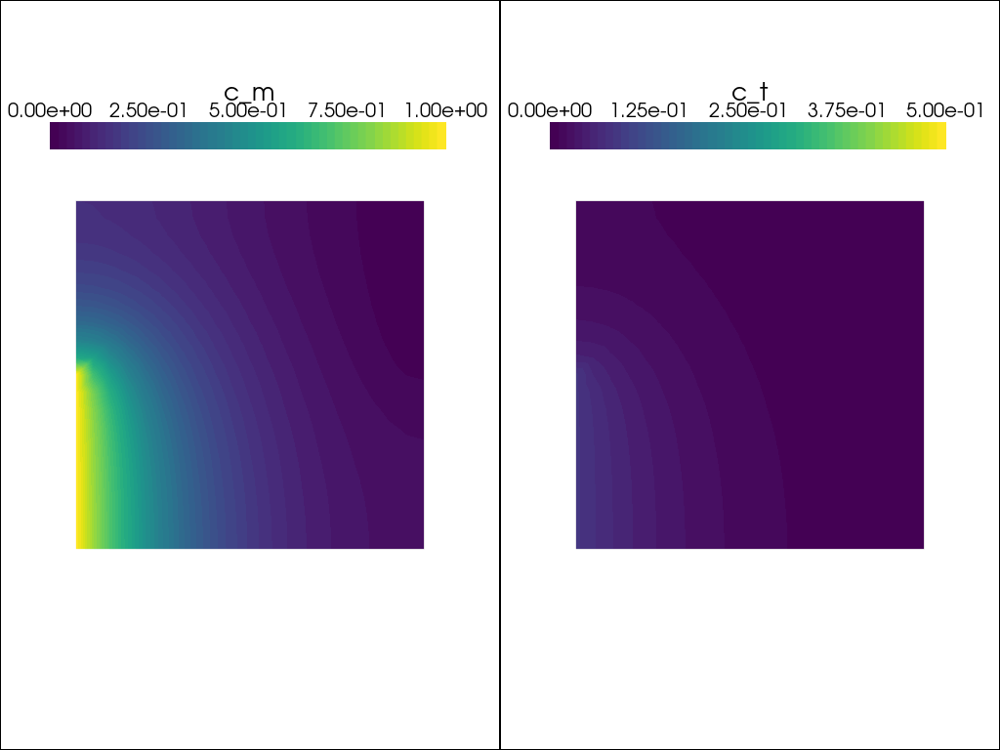

---
jupytext:
  formats: ipynb,md:myst
  text_representation:
    extension: .md
    format_name: myst
    format_version: 0.13
    jupytext_version: 1.19.1
kernelspec:
  display_name: festim-workshop
  language: python
  name: python3
---

# Build FESTIM from scratch #

+++

Objectives:
* Understand the FESTIM foundations
* Be better armed for contributing to FESTIM

+++

## Steady state problem

Let's consider a unit square $\Omega = [0, 1] \times [0, 1]$.

$c_m$ is the concentration of _mobile_ hydrogen, and $c_t$ is the concentration of _trapped_ hydrogen.


We want to solve the following steady state problem:

\begin{align}
    \nabla \cdot (D \nabla c_m) - R &= 0\quad \text{on } \Omega\\
    R &= 0\quad \text{on } \Omega\\
    R &= k c_m (n - c_t) - p \ c_t \\
    c_m &= 1 \quad \text{on } \Gamma_\mathrm{inlet} \\
    c_m &= 0\quad \text{on } \Gamma_\mathrm{outlet}
\end{align}


```{note}
In steady state, this problem is equivalent to:
\begin{align}
    \nabla \cdot (D \nabla c_m) &= 0\quad \text{on } \Omega\\
    R &= 0\quad \text{on } \Omega
\end{align}

Meaning that for the governing equation for mobile concentration is the same as a pure diffusive (no trap) case.

Furthermore,

$$
k c_m (n - c_t) = p \ c_t
$$

Leading to the direct expression for $c_t$:
$$
c_t = n \left(1 + \frac{p}{k\ c_m} \right)^{-1}
$$

This is sometimes referred as Oriani's equilibrium.
We won't solve it the "direct" way here as we are building up to a transient (non-equilibrium) case.

```


### Setting up the problem

+++

We start by importing the required modules and libraries:

```{code-cell} ipython3
import dolfinx
import numpy as np
import ufl
from dolfinx.fem.petsc import NonlinearProblem
from petsc4py import PETSc
from mpi4py import MPI
from dolfinx import mesh
from dolfinx import fem
import basix
```

We then create a mesh using `create_unit_square()`

```{code-cell} ipython3
nx = ny = 96

domain = mesh.create_unit_square(MPI.COMM_WORLD, nx, ny, mesh.CellType.quadrilateral)
```

Now that we have a mesh, we need to define a function space and appropriate functions and _test functions_:

```{code-cell} ipython3
# we create a mixed element with two components, both continuous galerkin degree 1
cg_element = basix.ufl.element("Lagrange", domain.basix_cell(), degree=1)

mixed_element = basix.ufl.mixed_element([cg_element, cg_element])

# then we make a functionspace from the mixed element
V = fem.functionspace(domain, mixed_element)

# we create a "main" function u which is a vector of the two components
u = fem.Function(V)

# to use the components in variational forms, we use ufl.split
# the first will be the mobile concentration cm, the second the trapped concentration ct
cm, ct = ufl.split(u)

# we create test functions for both components
v_cm, v_ct = ufl.TestFunctions(V)
```

Every finite element problem needs boundary conditions. Here we define three Dirichlet boundary conditions:

```{code-cell} ipython3
def inlet(x):
    return np.logical_and(np.isclose(x[0], 0), x[1] <= 0.5)

def outlet(x):
    return np.logical_and(np.isclose(x[0], 1), x[1] >= 0.5)

V0, submap = V.sub(0).collapse()

# the trick here was to pass both the subspace and the collapsed space to locate_dofs_geometrical
# in FESTIM we don't need this since we use meshtags for everything
# https://fenicsproject.discourse.group/t/dolfinx-dirichlet-bcs-for-mixed-function-spaces/7844/2

dofs_outlet = fem.locate_dofs_geometrical((V.sub(0), V0), outlet)
dofs_inlet = fem.locate_dofs_geometrical((V.sub(0), V0), inlet)

c_inlet = fem.Constant(domain, 1.0)
c_outlet = fem.Constant(domain, 0.0)

bc_outlet = fem.dirichletbc(c_outlet, dofs_outlet[0], V.sub(0))
bc_inlet = fem.dirichletbc(c_inlet, dofs_inlet[0], V.sub(0))
```

We then define the variational formulation (weak form)

```{code-cell} ipython3
# Problem parameters
k = 0.1  # trapping rate
p = 0.1  # detrapping rate
n = 1  # total trapping sites
D = 2.0 # diffusion coefficient

trapping = k * cm * (n - ct)
detrapping = p * ct

# NOTE everything is bundled in one variational form F
# the difference between the different equations is made with the test functions v_cm and v_ct
F_mobile = (
    D*ufl.dot(ufl.grad(cm), ufl.grad(v_cm)) * ufl.dx
    - trapping * v_cm * ufl.dx
    + detrapping * v_cm * ufl.dx
)
F_trapped = +trapping * v_ct * ufl.dx - detrapping * v_ct * ufl.dx

F = F_mobile + F_trapped
```

Now we can create a Newton solver:

```{code-cell} ipython3
# taken from https://github.com/FEniCS/dolfinx/blob/5fcb988c5b0f46b8f9183bc844d8f533a2130d6a/python/demo/demo_cahn-hilliard.py#L279C1-L286C28
use_superlu = PETSc.IntType == np.int64  # or PETSc.ScalarType == np.complex64
sys = PETSc.Sys()  # type: ignore
if sys.hasExternalPackage("mumps") and not use_superlu:
    linear_solver = "mumps"
elif sys.hasExternalPackage("superlu_dist"):
    linear_solver = "superlu_dist"
else:
    linear_solver = "petsc"

petsc_options = {
    "snes_type": "newtonls",
    "snes_linesearch_type": "none",
    "snes_stol": np.sqrt(np.finfo(dolfinx.default_real_type).eps) * 1e-2,
    "snes_atol": 1e-10,
    "snes_rtol": 1e-10,
    "snes_max_it": 100,
    "snes_divergence_tolerance": "PETSC_UNLIMITED",
    "ksp_type": "preonly",
    "pc_type": "lu",
    "pc_factor_mat_solver_type": linear_solver,
}

problem = NonlinearProblem(
    F,
    u,
    bcs=[bc_outlet, bc_inlet],
    petsc_options=petsc_options,
    petsc_options_prefix="Poisson",
)
```

### Solving

```{code-cell} ipython3
problem.solve()

converged = problem.solver.getConvergedReason()
num_iter = problem.solver.getIterationNumber()

assert converged > 0, f"Solver did not converge, got {converged}."
print(
    f"Solver converged after {num_iter} iterations with converged reason {converged}."
)
```

### Post processing

```{code-cell} ipython3
# we first split the main solution u into its components with .split()
cm_post, ct_post = u.split()  # NOTE this is different from ufl.split(u)

# for postprocessing, it's easier to work with collapsed functions
cm_post = cm_post.collapse()
ct_post = ct_post.collapse()
```

Visualise the results:

```{code-cell} ipython3
import pyvista
from dolfinx import plot

# domain.topology.create_connectivity(tdim, tdim)
u_topology, u_cell_types, u_geometry = plot.vtk_mesh(cm_post.function_space)


# plot cm
u_plotter = pyvista.Plotter()
u_grid = pyvista.UnstructuredGrid(u_topology, u_cell_types, u_geometry)
u_grid.point_data["cm"] = cm_post.x.array.real
u_grid.set_active_scalars("cm")
u_plotter.add_mesh(u_grid, show_edges=False)

u_plotter.view_xy()
if not pyvista.OFF_SCREEN:
    u_plotter.show()
```

```{code-cell} ipython3
ct_plotter = pyvista.Plotter()
ct_grid = pyvista.UnstructuredGrid(u_topology, u_cell_types, u_geometry)
ct_grid.point_data["ct"] = ct_post.x.array.real
ct_grid.set_active_scalars("ct")
ct_plotter.add_mesh(ct_grid, show_edges=False)


ct_plotter.view_xy()
if not pyvista.OFF_SCREEN:
    ct_plotter.show()
```

Compute the total inventory:

```{code-cell} ipython3
from scifem import assemble_scalar
inventory_cm = assemble_scalar(cm_post * ufl.dx)
inventory_ct = assemble_scalar(ct_post * ufl.dx)

print(f"Total inventory of mobile species: {inventory_cm:.4f}")
print(f"Total inventory of trapped species: {inventory_ct:.4f}")
```

Compute the outgassing fluxes:

```{code-cell} ipython3
tdim = domain.topology.dim
fdim = tdim - 1

inlet_facets = dolfinx.mesh.locate_entities_boundary(domain, fdim, inlet)
outlet_facets = dolfinx.mesh.locate_entities_boundary(domain, fdim, outlet)

inlet_values = np.full_like(inlet_facets, 1.0)
outlet_values = np.full_like(outlet_facets, 2.0)

entities = np.concatenate([inlet_facets, outlet_facets])
values = np.concatenate([inlet_values, outlet_values])

facet_meshtags = dolfinx.mesh.meshtags(domain, fdim, entities=entities, values=values)

ds = ufl.Measure("ds", domain=domain, subdomain_data=facet_meshtags)
```

```{code-cell} ipython3
n = ufl.FacetNormal(domain)

flux_form = -ufl.dot(D * ufl.grad(cm_post), n)

flux_inlet = -assemble_scalar(flux_form * ds(1))
flux_outlet = assemble_scalar(flux_form * ds(2))


print(f"Inlet flux: {flux_inlet:.4f}")
print(f"Outlet flux: {flux_outlet:.4f}")

print(f"Rel difference: {(flux_inlet - flux_outlet)/flux_inlet:.2%}")
```

## Transient problem

Now that we've solve a steady state problem, we're going to step it up by solving a transient problem.
We'll use the same geometry and similar parameters.

We'll also set the same boundary conditions with the difference that the value of one of the conditions will change with time.
The complete mathematical problem is:

\begin{align}
\frac{\partial c_m}{\partial t} &= \nabla \cdot (D \nabla c_m) - R \quad \text{on } \Omega\\
\frac{\partial c_t}{\partial t} &= + R \quad \text{on } \Omega\\
R &= k c_m (n - c_t) - p \ c_t \\
c_m &= \begin{cases}
1 \quad \text{for } t < 5 \\
0 \quad \text{otherwise}
\end{cases} \quad \text{on } \Gamma_\mathrm{inlet} \\
c_m &= 0\quad \text{on } \Gamma_\mathrm{outlet}
\end{align}

### Setting up

```{code-cell} ipython3
nx = ny = 96

domain = mesh.create_unit_square(MPI.COMM_WORLD, nx, ny, mesh.CellType.quadrilateral)
tdim = domain.topology.dim
fdim = tdim - 1
domain.topology.create_connectivity(fdim, tdim)
```

```{code-cell} ipython3
# we create a mixed element with two components, both continuous galerkin degree 1
cg_element = basix.ufl.element("Lagrange", domain.basix_cell(), degree=1)

mixed_element = basix.ufl.mixed_element([cg_element, cg_element])

# then we make a functionspace from the mixed element
V = fem.functionspace(domain, mixed_element)

# we create a "main" function u which is a vector of the two components
u = fem.Function(V)

# and a u_n function for the previous time step
u_n = fem.Function(V)

# to use the components in variational forms, we use ufl.split
# the first will be the mobile concentration cm, the second the trapped concentration ct
cm, ct = ufl.split(u)
cm_n, ct_n = ufl.split(u_n)

# we create test functions for both components
v_cm, v_ct = ufl.TestFunctions(V)
```

We use the same boudary conditions as the steady state case, with the exception that we will modify the value of `c_inlet` at $t=5$ to highlight transient effects.

```{code-cell} ipython3
def inlet(x):
    return np.logical_and(np.isclose(x[0], 0), x[1] <= 0.5)

def outlet(x):
    return np.logical_and(np.isclose(x[0], 1), x[1] >= 0.5)

V0, submap = V.sub(0).collapse()

# the trick here was to pass both the subspace and the collapsed space to locate_dofs_geometrical
# in FESTIM we don't need this since we use meshtags for everything
# https://fenicsproject.discourse.group/t/dolfinx-dirichlet-bcs-for-mixed-function-spaces/7844/2

dofs_outlet = fem.locate_dofs_geometrical((V.sub(0), V0), outlet)
dofs_inlet = fem.locate_dofs_geometrical((V.sub(0), V0), inlet)

c_inlet = fem.Constant(domain, 1.0)
c_outlet = fem.Constant(domain, 0.0)

bc_outlet = fem.dirichletbc(c_outlet, dofs_outlet[0], V.sub(0))
bc_inlet = fem.dirichletbc(c_inlet, dofs_inlet[0], V.sub(0))
```

The variational formulation is extremely similar, we just add a transient term using a first order backwards Euler time-stepping scheme.

```{code-cell} ipython3
# Problem parameters
k = 0.2  # trapping rate
p = 0.01  # detrapping rate
n = 0.5  # total trapping sites
D = 0.1 # diffusion coefficient

dt = dolfinx.fem.Constant(domain, 1.0)


# NOTE everything is bundled in one variational form F
# the difference between the different equations is made with the test functions v_cm and v_ct
F_mobile_transient = (cm - cm_n)/dt* v_cm * ufl.dx
F_trapped_transient = (ct - ct_n)/dt * v_ct * ufl.dx


trapping = k * cm * (n - ct)
detrapping = p * ct

F_mobile = (
    D*ufl.dot(ufl.grad(cm), ufl.grad(v_cm)) * ufl.dx
    + trapping * v_cm * ufl.dx
    - detrapping * v_cm * ufl.dx
)
F_trapped = -trapping * v_ct * ufl.dx + detrapping * v_ct * ufl.dx

F = F_mobile_transient + F_trapped_transient + F_mobile + F_trapped
```

We set up the nonlinear solver in the exact same way:

```{code-cell} ipython3
# taken from https://github.com/FEniCS/dolfinx/blob/5fcb988c5b0f46b8f9183bc844d8f533a2130d6a/python/demo/demo_cahn-hilliard.py#L279C1-L286C28
use_superlu = PETSc.IntType == np.int64  # or PETSc.ScalarType == np.complex64
sys = PETSc.Sys()  # type: ignore
if sys.hasExternalPackage("mumps") and not use_superlu:
    linear_solver = "mumps"
elif sys.hasExternalPackage("superlu_dist"):
    linear_solver = "superlu_dist"
else:
    linear_solver = "petsc"

petsc_options = {
    "snes_type": "newtonls",
    "snes_linesearch_type": "none",
    "snes_stol": np.sqrt(np.finfo(dolfinx.default_real_type).eps) * 1e-2,
    "snes_atol": 1e-10,
    "snes_rtol": 1e-10,
    "snes_max_it": 100,
    "snes_divergence_tolerance": "PETSC_UNLIMITED",
    "ksp_type": "preonly",
    "pc_type": "lu",
    "pc_factor_mat_solver_type": linear_solver,
    # "snes_monitor": None,
}

problem = NonlinearProblem(
    F,
    u,
    bcs=[bc_outlet, bc_inlet],
    petsc_options=petsc_options,
    petsc_options_prefix="poisson_transient",
)
```

Let's prepare a pyvista animation:

```{code-cell} ipython3
import matplotlib as mpl
c_m_post = u.split()[0].collapse()
c_t_post = u.split()[1].collapse()

grid_c_m = pyvista.UnstructuredGrid(*plot.vtk_mesh(c_m_post.function_space))
grid_c_t = pyvista.UnstructuredGrid(*plot.vtk_mesh(c_t_post.function_space))

grid_c_m.point_data["c_m"] = c_m_post.x.array
grid_c_t.point_data["c_t"] = c_t_post.x.array

viridis = mpl.colormaps.get_cmap("viridis").resampled(50)
sargs = dict(
    title_font_size=25,
    label_font_size=20,
    fmt="%.2e",
    color="black",
    position_x=0.1,
    position_y=0.8,
    width=0.8,
    height=0.1,
)

plotter = pyvista.Plotter(shape=(1, 2))
plotter.open_gif("transient.gif", fps=7)

plotter.subplot(0, 0)
plotter.view_xy(bounds=[0, 1, 0, 1, 0, 0])
_ = plotter.add_mesh(
    grid_c_m,
    show_edges=False,
    lighting=False,
    cmap=viridis,
    scalar_bar_args=sargs,
    clim=[0, 1],
)

plotter.subplot(0, 1)
plotter.view_xy(bounds=[0, 1, 0, 1, 0, 0])

_ = plotter.add_mesh(
    grid_c_t,
    show_edges=False,
    lighting=False,
    cmap=viridis,
    scalar_bar_args=sargs,
    clim=[0, n],
)
```

We make two empty lists for storing the inventory values:

```{code-cell} ipython3
inventories_cm = []
inventories_ct = []
times = []
```

`dolfinx` doesn't "know" anything about time. We set the time stepping loop ourselves.

At each timestep we:

- update `t`
- solve the nonlinear problem
- update the previous solution `u_n`
- update the inlet boundary condition
- perform the post processing tasks

```{code-cell} ipython3
t = 0.0
t_final = 30
n_it = 0

while t < t_final:
    t += dt.value
    n_it += 1
    times.append(t)

    # solve the problem with the current u_n as previous solution
    problem.solve()
    converged = problem.solver.getConvergedReason()
    num_iter = problem.solver.getIterationNumber()
    assert converged > 0, f"Solver did not converge, got {converged}."
    print(
        f"Time: {t:.2f} ({n_it=}). \n Solver converged after {num_iter} iterations with converged reason {converged}."
    )

    # update u_n with the current solution u
    u_n.x.array[:] = u.x.array[:]

    # update inlet value to show transient response
    c_inlet.value = 1.0 if t < 5 else 0.0

    # post processing
    c_m_post = u.split()[0].collapse()
    c_t_post = u.split()[1].collapse()

    # Update plot
    grid_c_m.point_data["c_m"][:] = c_m_post.x.array
    grid_c_t.point_data["c_t"][:] = c_t_post.x.array
    plotter.write_frame()

    # compute inventory
    inventories_cm.append(assemble_scalar(c_m_post * ufl.dx))
    inventories_ct.append(assemble_scalar(c_t_post * ufl.dx))

plotter.close()
```



```{code-cell} ipython3
import matplotlib.pyplot as plt

plt.stackplot(times, inventories_cm, inventories_ct, labels=["mobile", "trapped"])
plt.ylabel("Inventory")
plt.xlabel("Time")
plt.legend(reverse=True)
plt.show()
```
